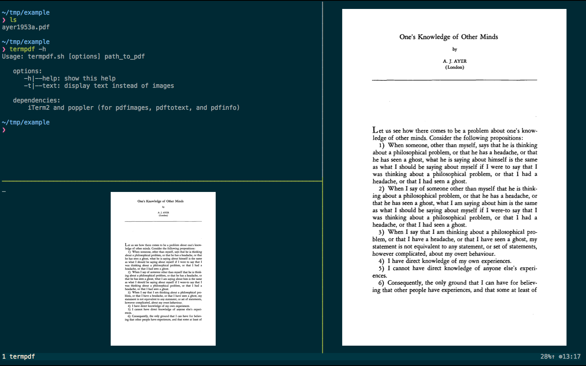

# README for termpdf

`termpdf` is a barebones inline terminal pdf (and djvu and tif) viewer that relies on [iTerm2's
support of inline images][]. Inline image support was added in iTerm 2.9,
so for the moment you will need to install [the beta test release or a nightly
build](https://iterm2.com/downloads.html).

Since it relies on iTerm2, it is Mac only. It shouldn't be hard to add support
for X11 and framebuffer, using w3m's `w3mimagedisplay` tool, but I don't have
that installed.

It works by converting each page of the pdf into a png, using Ghostscript.
If a pdf happens to already contain one image for each page, it
instead uses [Poppler][]'s `pdfimages` to extract those images. djvu files are
converted to png using dvjulibre's `dvjups` and ImageMagick's `convert`. tiff files are
converted to png using `convert`. 

It automatically sizes pages to fit within the terminal window (or, within
`tmux`, the pane).
It does not support zooming, but it does support autocropping of margins,
for which it relies on ImageMagick's `convert -trim` command.
It also supports text search, using `pdfgrep`, and a rudimentary paginated
text view, that relies on [Poppler][]'s `pdftotext`.

I wrote `termpdf` so that I could view PDF files while working
in tmux and iTerm2 in fullscreen mode.

It is not especially robust. In `tmux` I find that the image of the PDF often
goes missing. But pressing `r` usually suffices to bring it back.



# Installation

`termpdf` is a bash script. Put it somewhere in your path and make sure it has
the appropriate permissions (i.e., `chmod u+x termpdf.sh`).

Dependencies: 

-   Ghostscript (`gs`), ImageMagick (`convert`), Poppler
(`pdftotext`, `pdfimages`, and `pdfinfo`), and `pdfgrep`
-   djvulibre for djvu support

To install these via homebrew, try

```
brew install gs imagemagick poppler pdfgrep djvulibre
```


# Usage


`$ termpdf.sh [options] file.pdf`

options: 

-   `-h` or `--help` to get some help
-   `-t` or `--text` to display text instead of images
-   `-n <number>` to open the PDF at a given page number.

While viewing a PDF, the commands are:

~~~
   j/k:         page back/forward
   enter/space  page forward
   g <number>:  go to page number
   NNN:         go to page number NNN
   r:           resize and redraw to fit pane
   m:           toggle autocropped margins
   t:           toggle text/image display
   y:           yank current page as text to clipboard
   / <expr>     go to page with first match for <expr>
   n:           go to next match for <expr>
   h:           print this help
   p:           switch to between pagers in text mode
   w:           wrap lines in text mode
   q:           quit
~~~


  [iTerm2's support of inline images]: https://iterm2.com/images.html
  [Poppler]: http://poppler.freedesktop.org/
