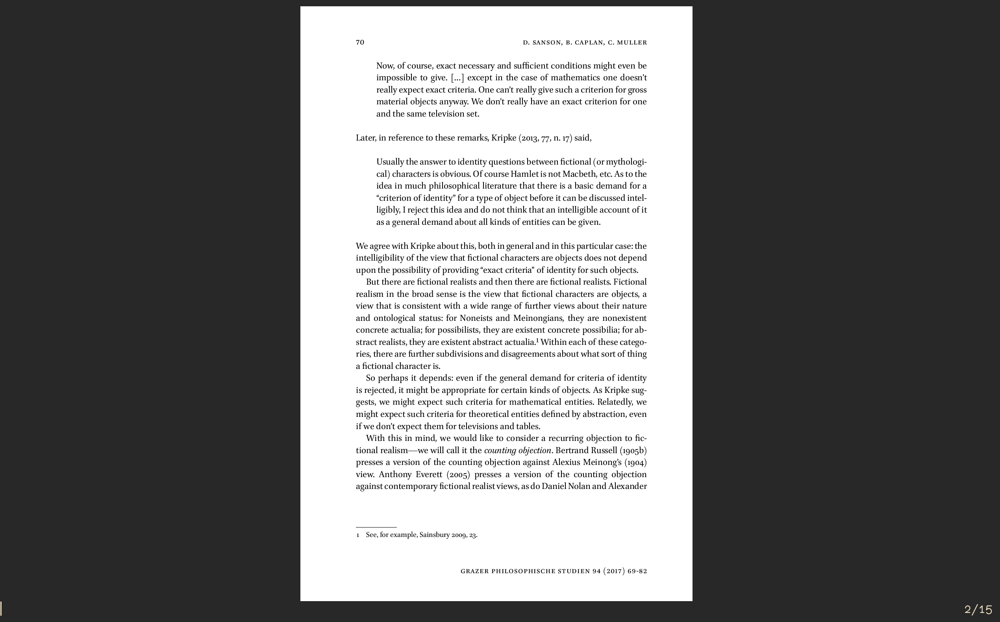
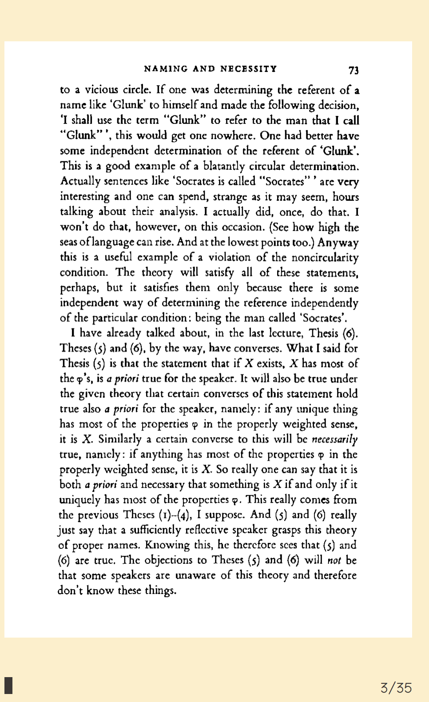
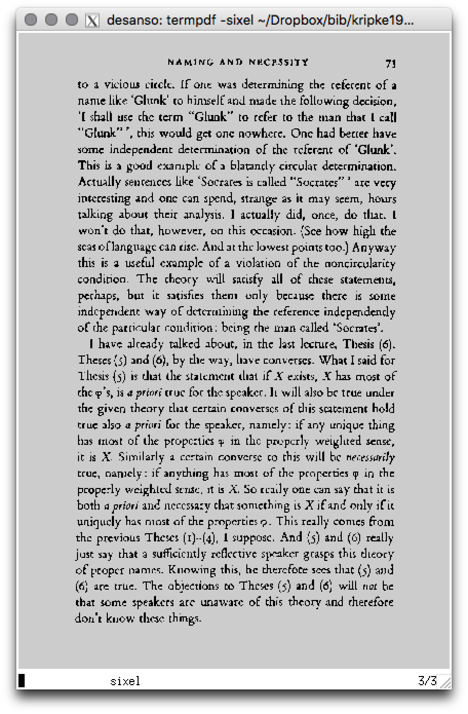

termpdf.py
=========

I decided to try again, in python, using pymupdf as a backend, and dropping support for iTerm2 and focusing just on kitty's more robust graphics support. The preliminary results are snappier, and it should be easy to add more powerful features:

<https://github.com/dsanson/termpdf.py>

termpdf
=======

`termpdf` is a barebones graphical PDF (and DJVU and TIFF and CBR and
CBZ and JPG and PNG and GIF and BMP) viewer that runs in your terminal.

Right now, it runs in

-   [iTerm](https://iterm2.com/) 2.9 or later
-   [kitty](https://github.com/kovidgoyal/kitty)

And has experimental support for

-   [libsixel](https://github.com/saitoha/libsixel)

It is a ridiculous hack---a bash script wrapped around some special terminal
escape codes and a bunch of command line tools. But it works well enough for me to be useful.

Screenshots
===========

Running in Kitty:



Running in iTerm:



Requirements
============

Let me start with the tl;dr instructions. 

Make sure you are running a recent version of Kitty or iTerm.

Install `terminal dimensions`:

~~~
git clone https://github.com/dsanson/terminal_dimensions
cd terminal_dimensions
gcc terminal_dimensions.c -o terminal_dimensions
mv terminal_dimensions /usr/local/bin
~~~

Install dependencies. On OSX,

```.bash
brew install poppler djvulibre libtiff unrar imagemagick bash
```

On Debian,

```.bash
apt install ghostscript bc libtiff5 unrar imagemagick poppler-utils
```
On Archlinux and its derivatives

```.bash
pacman -S bc poppler djvulibre ghostscript libtff unrar imagemagick
```

termpdf is also available in the [Arch User Repository](https://aur.archlinux.org/packages/termpdf-git/). You can install it using your favorite AUR helper program, which should also handle the dependencies, including `terminal_dimensions`. For example, using yay:

```bash
yay -S termpdf-git
```

Download the `termpdf` and `tpdfc` scripts, make them executable, and put them in your path:

```.bash
git clone https://github.com/dsanson/termpdf
cd termpdf
chmod u+x termpdf
chmod u+x tpdfc
cd /usr/local/bin
ln -s /path/to/termpdf
ln -s /path/to/tpdfc
```

Terminal Emulator
-----------------

You will need iTerm version 2.9 or later, or Kitty, version greater than 0.6.1,
or, if you want to play around, a terminal with sixel support. iTerm support
has been around for awhile. It should be pretty stable if a bit slow. Kitty
support is new and significantly faster than iTerm---especially if you use the
`terminal_dimensions` helper app.

To use with Kitty, be sure that the `kitty` executable is in your path.

A previous version of the script tried to support X11 using `w3mimgdisplay`.
That got complicated and it didn't work, so I removed it. But recent changes
to the code probably make it easier to implement.

terminal_dimensions
-------------

This is a tiny command line tool written in C that reports terminal
dimensions, both in character cells and in pixels, e.g.,

~~~
$ terminal_dimensions
141 43 2538 1548
~~~

This is helpful, because standard cli tools don't report pixel dimensions. But
in many emulators, including iTerm, the pixel dimensions will be misreported as 0 and 0:

~~~
$ terminal_dimensions
141 43 0 0
~~~

This is too bad, because pixel dimensions are super helpful! Install this, and
image rendering in Kitty is *much* faster. Also, you will need this if you
want to play around with the `sixel` support.

~~~
$ git clone https://github.com/dsanson/terminal_dimensions
$ cd terminal_dimensions
$ gcc terminal_dimensions.c -o terminal_dimensions
$ mv terminal_dimensions /usr/local/bin
~~~

Poppler, djvulibre, libtiff, unrar, imagemagick, ghostscript
-------

The script uses `pdfseparate` and `pdfinfo`, from Poppler to manipulate PDFs, `ddjvu` and `djvudump`, from DJVULibre, to manipulate DJVU files, and `tiffutil` and `tiffinfo`, to manipulate TIFF files. It uses `unrar` and `unzip` to unpack CBR and CBZ files. It uses ImageMagick's `convert` and `identify`. And it uses Ghostscript to convert PDFs to PNGS, because it is faster, and offers more control, than Poppler's `pdfcairo`.

On OS X, you can install all these things by running:

    $ brew install poppler djvulibre libtiff unrar imagemagick

Bash 4.x
--------

If you run the script from Bash 4.x, it supports marks. OS X still ships with Bash 3.x, so,

    $ brew install bash

LibreOffice
-----------

I've added basic support for viewing Microsoft Office (docx, xlsx, pptx) and
LibreOffice (odt, ods, odp) files. The script converts them to PDF using
LibreOffice, and then displays the resulting PDF. For this to work, you'll
need to have a copy of LibreOffice installed in your `/Applications` folder.

TODO: As written, this probably only works on OS X.


Libsixel
--------

If you want to try out the experimental sixel support, be sure you have `terminal_dimensions` installed. You also need to install 

-   [libsixel](https://github.com/saitoha/libsixel)

and make sure that the `img2sixel` command is in your path. Then try:

```
$ termpdf -sixel <file>
$ termpdf -sixel <directory>
```

Here is a screenshot of the best results I can get using a version of xterm built with sixel support on OS X:



Installation
============

`termpdf` and `tpdfc` are bash scripts. Put them somewhere in your path and make sure they have
the appropriate permissions (i.e., `chmod u+x termpdf`).


Usage
=====

```.bash
$ termpdf -h
termpdf <options> <file/directory>
  -d n, --depth N                    how deep to search directories for images
  -sixel                             use libsixel to (badly) display graphics     
  -kitty                             force using kitty to display graphics
  -iterm                             force using iterm to display graphics
  -k                                 list keyboard shortcuts
  -h, --help                         view this help
```

`<file/directory>` should be a file in one of the supported formats or a path
to a directory containing images.

Format is determined by extension. Supported multipage are formats: 

    PDF, DJVU, TIF, CBR, CBZ, CBT

Supported single image formats are

    JPG, JPEG,  PNG, GIF, BMP, SVG, PBM, PNM, ICO, PCD, PICT, PES, PSD, TTF, XCF

It should be trivial to add support for any format that Imagemagick
supports that doesn't require special handling.

Directories, along with common archive formats (ZIP, RAR, and TAR), are
treated as multipage documents. Directories are searched recursively by
`find`, and displayed in the order found. The `--depth` option specifies the
depth of `find`'s recursive search.

By default, `termpdf` uses Kitty's image rendering if it is available, and
otherwise tries to use iTerm's image rendering. You can override this behavior
by specifying one of `-sixel`, `-kitty`, or `-iterm`.

Keyboard Shortcuts
------------------

```bash
$ termpdf -k
Keyboard shortcuts:

  enter/space:                   forward one page
  [n]k/j:                        forward or back [n] pages
  [n]G:                          go to page [n]
  G:                             go to last page
  gg:                            go to first page
  /<query>:                      search text for <query>
  [n]n:                          go to next search result
  [n]N:                          go to previous search result
  [n]p:                          print [n copies of] document
  [n]y:                          yank [n] pages forward and save as pdf
  yy:                            yank current page and save as pdf
  [n]+:                          zoom in (currently broken)
  [n]-:                          zoom out (currently broken)
  =:                             fit screen (currently broken)
  c:                             crop margins 
  m[r]:                          store current page in register [r]
  '[r]:                          go to page stored in register [r]
  g'[r]:                         go to to page in register [r] 
  y'[r]:                         yank from current page to mark and save as pdf
  r:                             refresh display
  R:                             reload document
  [n]r:                          rotate [n] degrees (0=0;1=90;2=180;3=270)
  t:                             view entire document as text in less
  T:                             view current page as text in less
  M:                             remake document
  a:                             annotate in split pane
  q:                             quit
  h:                             view this help
  u:                             user definable function
```

These commands are all set by the `keys()` function. You can override them in the config file if you
want.

There is also mostly undocumented support for `:` style commands, e.g.,

  :first                                go to first page
  :last                                 go to last page
  :goto 20                              go to page 20
  :print <copies> <page-range>
  :yank <page-range>
  :search <query>
  :next <count>
  :gui                                  open the document in your default viewer
  :text all
  :text page
  :refresh
  :reload
  :rotate 90
  :crop
  :marks                                list marks
  :quit                                 quit

This is mostly useless from within the software, because bash's `read` command
doesn't support customizable autocompletion when called within scripts. But it
is useful when using `tpdfc`.

# Controlling `termpdf` using `tpdfc`

You can issue `:` style commands to a running instance of `termpdf` using the command
`tpdfc`. For example,

    $ tpdfc goto 5

will flip to page 5. If more than one instance of `termpdf` is running, you
can specify the instance you wish to control either by PID or just by number:

    $ tpdfc -n 2 goto 5
    $ tpdfc -p <PID> goto 5

To list all available instances,

    $ tpdfc -l

# Configuration files

You can put any commands you want into `$HOME/.config/termpdf/config`, which
is sourced during the setup process. This allows you, among other
things, to override the key mappings and tweak the print settings.

You can also put commands in `$HOME/.config/termpdf/exithook`, which will be
sourced before the script exits. 

# Known issues

-   Earlier versions of the script worked well with tmux on iTerm. The current version does not. I'm not sure why.

-   The make command only works if you have a Makefile in the same
directory as the PDF. It would be nice to support a configurable make command.

-   There is no robust error checking. This is just a bash script. So occasionally
it will just crash or fart or do something unexpected.

# TODO

-   rewrite in real language (using ncurses?).
-   rewrite kitty support using escape codes instead of `kitty icat`
    
# Similar Projects

Emacs users already know about
[pdf-tools](https://github.com/politza/pdf-tools). It would be amazing to
replicate its level of functionality for a pdf viewer in the tmux+vim
workflow.


-   [fbpdf](http://repo.or.cz/fbpdf.git): a pdf viewer for the framebuffer
    with vim-like navigation.
-   [jfbview](https://seasonofcode.com/pages/jfbview.html): another pdf viewer for
    the framebuffer.
-   [imgcat](https://iterm2.com/images.html): the sample imgcat implementation
    from the developer of iTerm2. Works in tmux. Doesn't provide control over
    width and height of image.
-   [term-img](https://github.com/sindresorhus/term-img): javascript node
    library for viewing images in iTerm2. Also offers a command line tool.
    Doesn't work in tmux.
-   [imgcat-cli](https://github.com/egoist/imgcat-cli): a javascript node
    image viewer for iTerm2 (fork of term-img). Doesn't work in tmux.
-   [termimg](https://github.com/frnsys/termimg): uses `w3mimgdisplay`.

